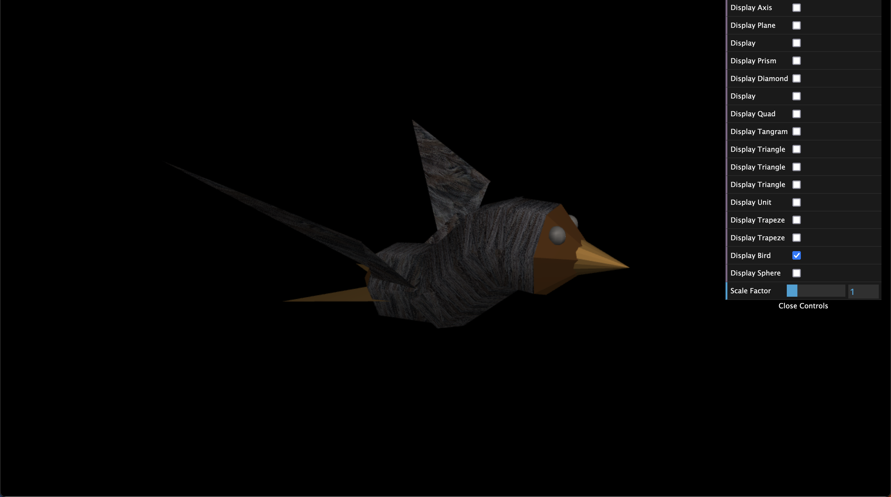
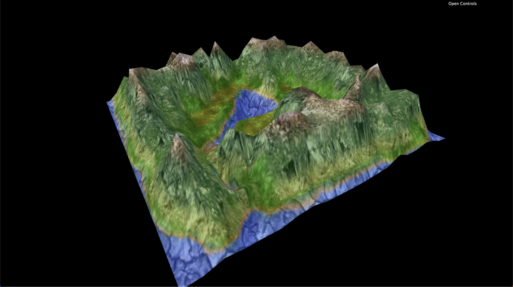

# Project - Computer Graphics

## Group Elements
André Barbosa - up202007398   
Guilherme Almeida - up202008866

 ## Features and Observations
 Every feature requested was fully implemented:
 * sphere creation with variable number of slices and stacks.
 * panorama creation, plus panorama following camera position 
 * bird modeling, animation and control
 * terrain, with original terrain texture color combined with the gradient color using the altimetry.
 * eggs, with random locations at each refresh.
 * nest creation.
 * bird/eggs/nest interaction - the bird is able to pick up one egg at a time and drop it into the nest.
 * tree group patch and tree row patch integration, with random misalignedment and random textures at each refresh.
 * aditional feature, parabola trajectory of the egg when dropped.

## Screenshots

|                                                                    |                                                              |  |
|:---:|:---:|:---:|
| Panorama view | Panorama view 2 | Bird modeling |
|                                                         |                     |  |
| Terrain | Terrain 2 | Terrain w/eggs and nest |
|                                                         |                                                |  |
| Terrain w/trees | Terrain w/trees2 | Final |

