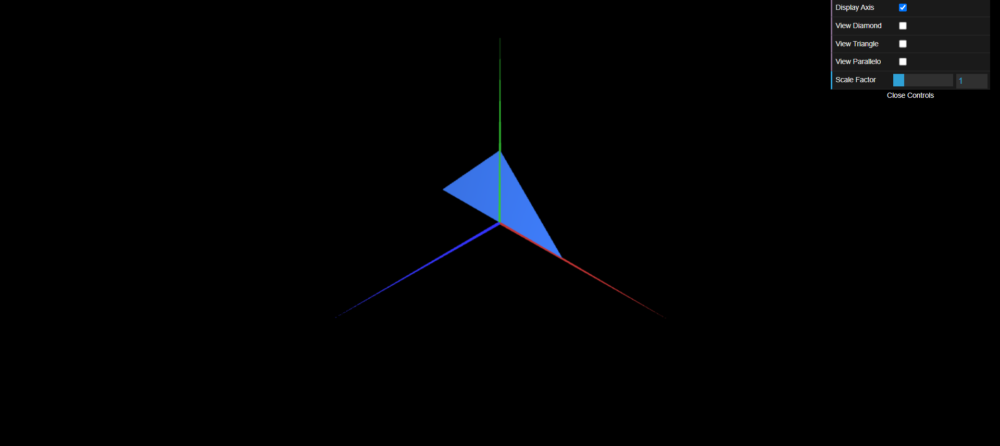

# CG 2022/2023

## Group T06G09

## TP 1 Notes

- In exercise 1 we observed a composed figure that resembles an arrow. We also observed that we need to organize the indexes in different directions if we want the figure to be visible on both sides, as we did with the Parallelogram.
- In exercise 2 we created 2 triangles of different dimensions, we observed that the small one would be covered by the big one, which means we can only see a triangle.
- In general we had no difficulties with the exercises.

