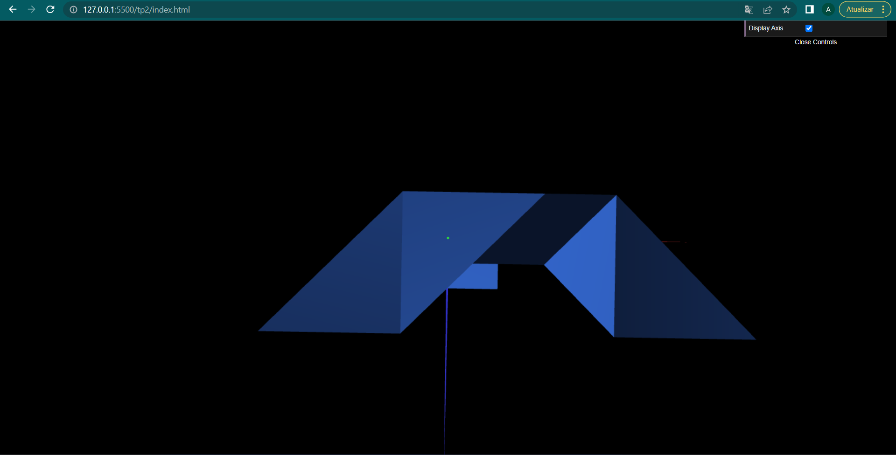

# CG 2022/2023

## Group T06G09

## TP 2 Notes

- In exercise 2 we used the 2 different ways of doing geometric transformations. We used translation, rotation and reflexion processes and managed to achieve the tangram requested.

- In exercise 3 we created a unitary cube. In order to use it as a base to the tangram, we translated the cube -0.5 in z direction, then to be parallel to XZ we rotated -90º around X axis and finally adjusted to the requested position.
  

- In exercise 3 we created a new unitary cube with a square. We used rotation and translation to place the square as faces of the cube, so we could do display of the same square in different ways. Then we proceeded as the exercise before and obtained the same result.

